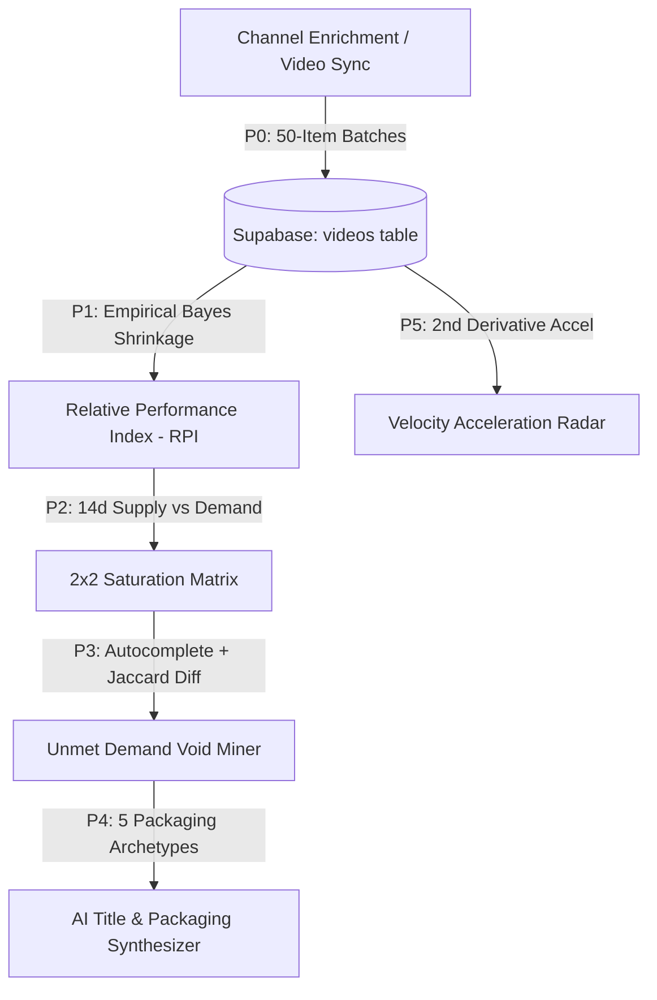

# ⚡ YT Tracker — YouTube Competitive Intelligence & Growth Studio

A production-grade, full-spectrum competitive intelligence platform and creator workflow suite for YouTube creators. Built with a professional **Linear / Raycast-calibre Obsidian SaaS aesthetic** (Linear Indigo palette, layered depth, instant tab skeleton transitions, Lucide vector icons), a high-performance **Flask & Modular Vanilla JS** architecture, cloud PostgreSQL persistence via **Supabase**, and zero unnecessary YouTube Data API quota overhead.

---

## 🌟 Platform Highlights & Intelligence Architecture (v2.2)



### 1. 💎 Professional Linear / Raycast Workspace Design (v2.2)
- **2-Pane Workspace Architecture**: Collapsible sidebar with active channel quick-selector, contextual navigation, compare tray indicator, and command menu shortcuts (`⌘K`).
- **Linear Indigo & Monochrome Slate Palette**: Minimalist, high-contrast typography (`Inter` & `JetBrains Mono`) with subtle Linear Indigo accents (`#6366f1`) and crisp tabular figures, completely eliminating rainbow numbers and neon gradients.
- **Instant Tab Skeleton Loading Screens**: Rich, tailored shimmer skeleton placeholders render instantly upon switching tabs, transitioning seamlessly into live telemetry via smooth cubic-bezier animations.
- **Tactile Card Depth & Bevels**: Layered dark surfaces (`#090a0c`, `#0e1015`, `#14171f`, `#1a1e28`) with 1px top highlight bevels (`inset 0 1px 0 rgba(255,255,255,0.05)`), subtle gradient overlays, and smooth hover elevation.
- **Vector Lucide Icons Suite**: Clean, sharp vector iconography replacing legacy ligatures for zero layout shift (CLS).

---

### 2. 🧠 Advanced Intelligence Engine
- **Module 0 (P0) — Video Persistence Sync**:
  - Durable `videos` table in Supabase persisting complete catalog metadata.
  - Mutable `title` column supporting title A/B testing and revisions.
  - 180-second vertical YouTube Shorts heuristic.
  - Historical backfill CLI tool (`scripts/backfill_videos.py`) operating in non-blocking 50-item batches.
- **Module 1 (P1) — Relative Performance Index (RPI) + Empirical Bayes Shrinkage**:
  - Replaces raw view counts with channel-normalized $RPI = \frac{\text{views}}{\text{channel\_baseline}}$.
  - Empirical Bayes Shrinkage formula prevents small-sample skew:
    $$RPI_{shrunken} = w \cdot RPI + (1 - w) \cdot 1.0, \quad \text{where } w = \frac{n}{n + 5}$$
- **Module 2 (P2) — Supply/Demand Saturation Matrix**:
  - Real-time 2×2 grid categorization:
    - 🌊 **Blue Ocean** (*High Demand · Low Supply*) — Scored via $\text{Score} = \frac{RPI_{shrunken}}{1 + \text{Supply}_{14d}}$.
    - 🔥 **Red Ocean** (*High Demand · High Supply*) — Hyper-competitive niches requiring standout packaging.
    - 🌱 **Niche / Emerging** (*Low Demand · Low Supply*) — Early-stage topics for first-mover moats.
    - ⚠️ **Saturated** (*Low Demand · High Supply*) — Overcrowded topics with diminishing returns.
- **Module 3 (P3) — Autocomplete Void Miner**:
  - Real-time Google/YouTube autocomplete suggestion mining ($\le 2$ depth).
  - Jaccard token overlap analysis ($\le 0.40$ threshold) against tracked competitor catalogs.
  - Automatically isolates **Unmet Search Voids** from **Competitor Covered Queries**.
- **Module 4 (P4) — AI Title & Packaging Synthesizer**:
  - 5 proven high-CTR packaging archetypes (*Impossible Feat*, *Hidden Flaw*, *Head-to-Head Clash*, *Zero-to-Mastery*, *Stress Test*).
  - Generates 16:9 **Thumbnail Concept Blueprints** with specific recommendations for **Layout**, **Focal Subject**, **Color Contrast**, and **Text Overlay**.
  - 1-Click transfer to Title Lab scorer or Kanban pipeline.
- **Module 5 (P5) — Velocity Acceleration Radar**:
  - Computes 2nd derivative view accrual acceleration ($\frac{d^2V}{dt^2}$).
  - Identifies breakthrough competitor drops before traditional view totals reflect virality.

---

### 3. 📊 Executive Command Center (Dashboard)
- **Primary Channel Hero Banner** — Real-time subscriber counters, 30-day velocity sparklines, next subscriber milestone progress rings, and live sync status.
- **Strategic Prescription (Next Best Action)** — Live algorithmic engine diagnosing optimal upload timing, topic synergy, and upload cadence gaps.
- **4-Metric Executive KPI Grid** — High-contrast metrics for Subscribers, Total Views (with 30-day velocity delta), Avg Views / Video, and Audience Engagement Rate.
- **30-Day Performance Trajectory Curve** — Smooth Chart.js curve comparing views velocity and monthly upload cadence.
- **2-Column Activity Forensics Split** — Side-by-side comparative inspection of your recent drops and the competitor radar feed.

---

### 4. ⚔️ Competitor Benchmark Grid
- **Instant Search & Filter Toolbar** — Real-time instant filtering by channel name, handle, or country with zero page reload.
- **Linear-Grade Data Grid** — Clean sortable columns (Subscribers, Avg Views, Total Views, Video Count, 30-Day Trend Sparklines, Threat Index).
- **Competitor Sparklines** — Real-time 30-day view velocity curves embedded directly in table rows.
- **Channel Deep-Dive Inspector Overlay** — 1-Click forensic inspection with 90-day upload pulse, top uploads, evergreen detection, and topic moats.

---

### 5. 🛰️ Topic Opportunities & Strategic Radar
- **High-Impact Blue Ocean Gaps Hero** — Pinpoints high-traffic topics where competitors are actively gaining views while your channel has 0 uploads.
- **Quadrant Filtering & Topic Search** — Filter the catalog across Blue Ocean, High Demand, Emerging, and Saturated quadrants.
- **De-Cluttered Opportunity Cards** — Clean status tags, niche video coverage, and 1-click test transfer to Creator Studio.

---

### 6. 🎬 Creator Studio & Content Pipeline
- **Title Lab Real-Time Scorer (0–100 CTR)**:
  - Algorithmic scoring based on length bounds, niche keyword resonance, hook & intrigue formulas, and structure.
  - Interactive token pills to append surging niche topic tokens.
- **Algorithmic Concept Generator**:
  - Synthesizes your channel moats, untapped field gaps, and trending velocity spikes into ready-to-use video title formulas.
- **4-Stage Drag-and-Drop Kanban Pipeline**:
  - Stage tracking: `Idea` $\to$ `In Production` $\to$ `Scheduled` $\to$ `Published` with auto-sync telemetry.

---

## 🏗️ Architecture & Codebase Structure

```text
Youtube-Data-Manager/
├── server.py                   # Flask backend with 7 intelligence endpoints & Supabase sync
├── requirements.txt            # Python dependencies
├── Procfile                    # Production deployment configuration (Gunicorn)
│
├── scripts/
│   ├── schema_v2.sql           # Database schema (videos, channel_baselines, topic_metrics, voids, velocity)
│   └── backfill_videos.py      # Standalone historical video backfill utility
│
├── static/
│   ├── index.html              # Core application DOM shell (2-Pane Layout + Modals)
│   ├── style.css               # Master stylesheet aggregator (@import)
│   │
│   ├── css/                    # Modular Style System
│   │   ├── variables.css       # Design tokens (Linear Indigo, deep obsidian surfaces, shadows)
│   │   ├── base.css            # Layout resets, buttons, badges, tab skeletons & keyframes
│   │   ├── dashboard.css       # Dashboard hero, KPI grid, Chart.js wrap, activity split
│   │   ├── deep-dive.css       # Channel forensics inspector modal & video matrix
│   │   ├── studio.css          # Title Lab, Concept Generator, Kanban pipeline
│   │   ├── modals.css          # Command palette, Settings, Reports, Popovers
│   │   └── print.css           # @media print rules for PDF report dossiers
│   │
│   └── js/                     # Modular JavaScript Engine
│       ├── state.js            # Global state, constants, scoreTone, AnimKit
│       ├── api.js              # API client, quota accounting, Supabase video sync
│       ├── nlp-topics.js       # Topic radar, Shrunken RPI, 2x2 Saturation Matrix, Blue Ocean gaps
│       ├── timing.js           # Publication timing heatmap, slot recommender & timezone engine
│       ├── dashboard.js        # Overview KPI grid, 30-day trajectory curve, Next Best Action
│       ├── channels.js         # Competitor benchmark data grid, instant filter, sparklines
│       ├── studio.js           # Title Lab CTR scorer, Concept Generator, AI Synthesizer & Kanban
│       ├── deep-dive.js        # Deep dive forensic inspector overlay
│       ├── settings-inbox.js   # Settings control room & alert inbox feed
│       ├── report-gamification.js # Report Center, Achievements & State URL sync
│       └── main.js             # Routing, tab skeleton injector, command palette & wayfinding
│
└── yt_channel_viewer.py        # Standalone Python Desktop GUI (Tkinter + Pillow)
```

---

## 🛠️ Technology Stack

- **Backend**: Python 3.8+ / Flask / Gunicorn
- **Database & Persistence**: Supabase (Cloud PostgreSQL) via `supabase-py` SDK
- **Frontend Architecture**: Vanilla HTML5, Modular CSS3 (Obsidian Dark Tokens, Linear Indigo Palette), Modular ES6+ JavaScript
- **Charting & Visualizations**: Chart.js 4.x (Linear curves, subtle gradient fills), SVG Sparklines
- **Icons**: Lucide Icons (vector SVG)
- **Typography**: Inter (UI & Displays), JetBrains Mono (Tabular Numerals & Monospace)
- **API**: YouTube Data API v3 (`google-api-python-client`) with thread-local client pooling and zero-quota client caching
- **AI / LLM**: Multi-provider support (Gemini, OpenAI, Anthropic, Groq) with deterministic algorithmic fallbacks
- **Desktop Companion**: Python Tkinter / Pillow (PIL)

---

## 📦 Setup & Installation

### 1. Clone & Install Dependencies
```bash
git clone https://github.com/khuzaima175/Youtube-Data-Manager.git
cd Youtube-Data-Manager

# Create and activate virtual environment
python -m venv .venv
.\.venv\Scripts\activate       # Windows
source .venv/bin/activate      # macOS/Linux

# Install requirements
pip install -r requirements.txt
```

### 2. Configure Environment Variables
Create a `.env` file in the root directory:
```env
YOUTUBE_API_KEY=your_youtube_api_key_here
SUPABASE_URL=https://your-project.supabase.co
SUPABASE_SERVICE_KEY=your_supabase_service_key_here
GEMINI_API_KEY=your_optional_gemini_key
OPENAI_API_KEY=your_optional_openai_key
FLASK_DEBUG=0
PORT=5000
ALLOWED_ORIGINS=http://localhost:5000,http://127.0.0.1:5000
```

### 3. Apply Database Migration (Supabase SQL Editor)
1. Open your [Supabase Dashboard](https://app.supabase.com) and go to the **SQL Editor**.
2. Run the SQL script in [`scripts/schema_v2.sql`](file:///g:/Important%20Projects/Youtube%20Data%20Manager/scripts/schema_v2.sql).
3. *(Optional)* Seed historical video data:
   ```bash
   python scripts/backfill_videos.py --all
   ```

### 4. Run Locally
```bash
# Start Flask Server
python server.py

# Open your browser at http://localhost:5000
```

---

## ⌨️ Keyboard Shortcuts Reference

| Shortcut | Action |
|---|---|
| `Ctrl + K` / `Cmd + K` | Open Command Palette |
| `/` | Focus Search Channels |
| `?` | Open Keyboard Shortcuts & Help |
| `1` | Switch to Dashboard |
| `2` | Switch to My Channels |
| `3` | Switch to Creator Studio |
| `R` | Refresh All Tracked Channels |
| `[` / `]` | Toggle Compact / Comfortable UI Density |
| `Escape` | Close any open modal / deep dive / popover |

---

## ⚖️ License
MIT License. Developed for YouTube creators and analytics intelligence. Ensure compliance with YouTube API Terms of Service.