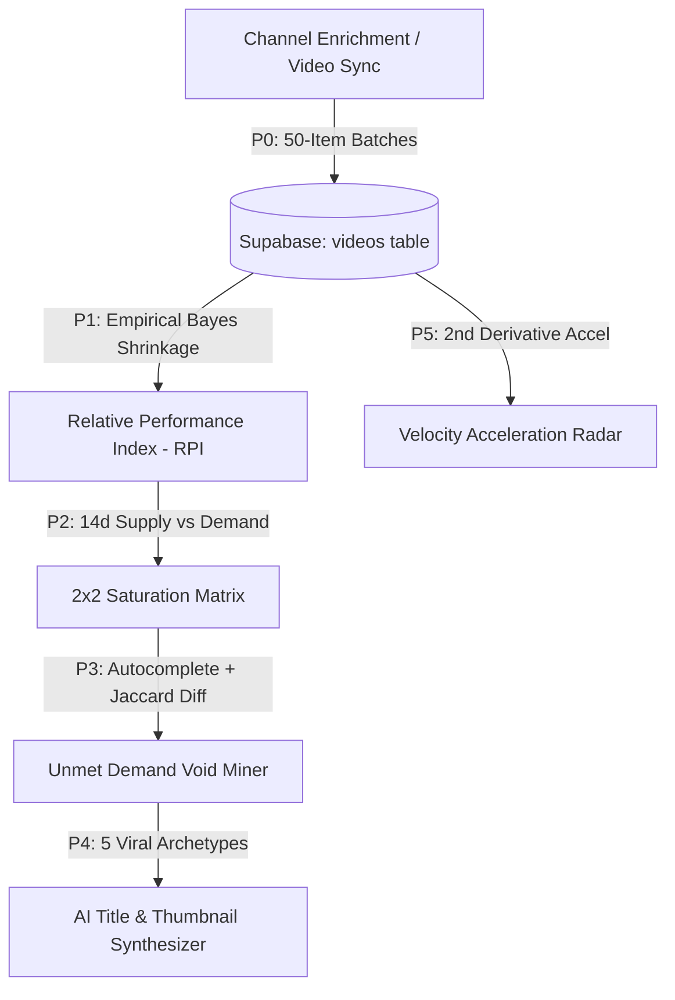

# ⚡ YT Tracker — YouTube Competitive Intelligence & Growth Studio

A production-grade, full-spectrum competitive intelligence platform and creator workflow suite for YouTube creators. Built with a sleek obsidian SaaS aesthetic (inspired by Linear & Vercel), a high-performance **Flask & Modular Vanilla JS** architecture, cloud PostgreSQL persistence via **Supabase**, and zero unnecessary YouTube Data API quota overhead.

---

## 🌟 Platform Highlights & Intelligence Engine (v2.1)



### 1. 🧠 Advanced Intelligence Engine (v2.1)
- **Module 0 (P0) — Video Persistence Sync**:
  - Durable `videos` table in Supabase persisting complete catalog metadata.
  - Mutable `title` column supporting title A/B testing and revisions.
  - 180-second vertical YouTube Shorts heuristic.
  - Historical backfill CLI tool (`scripts/backfill_videos.py`) operating in non-blocking 50-item batches.
- **Module 1 (P1) — Relative Performance Index (RPI) + Empirical Bayes Shrinkage**:
  - Replaces raw view counts with channel-normalized $RPI = \frac{\text{views}}{\text{channel\_baseline}}$.
  - Empirical Bayes Shrinkage formula prevents small-sample skew:
    $$RPI_{shrunken} = w \cdot RPI + (1 - w) \cdot 1.0, \quad \text{where } w = \frac{n}{n + 5}$$
- **Module 2 (P2) — Supply/Demand Saturation Matrix**:
  - Real-time 2×2 grid categorization:
    - 🌊 **Blue Ocean** (*High Demand · Low Supply*) — Scored via $\text{Score} = \frac{RPI_{shrunken}}{1 + \text{Supply}_{14d}}$.
    - 🔥 **Red Ocean** (*High Demand · High Supply*) — Hyper-competitive niches requiring standout packaging.
    - 🌱 **Niche / Emerging** (*Low Demand · Low Supply*) — Early-stage topics for first-mover moats.
    - ⚠️ **Saturated** (*Low Demand · High Supply*) — Overcrowded topics with diminishing returns.
  - Interactive toggle in the Topic Radar: `[ 🔥 RPI View ]` and `[ 🗺️ Saturation Matrix ]`.
- **Module 3 (P3) — Autocomplete Void Miner**:
  - Real-time Google/YouTube autocomplete suggestion mining ($\le 2$ depth).
  - Jaccard token overlap analysis ($\le 0.40$ threshold) against tracked competitor catalogs.
  - Automatically isolates **💎 Unmet Search Voids** from **⚔️ Competitor Covered Queries**.
- **Module 4 (P4) — AI Title & Packaging Synthesizer**:
  - 5 proven high-CTR packaging archetypes:
    1. 🏆 *Impossible Feat*
    2. 🚨 *Hidden Flaw / Counter-Intuitive*
    3. ⚔️ *Head-to-Head Clash*
    4. 🎓 *Zero-to-Mastery Roadmap*
    5. 💥 *Stress Test / Extreme Constraint*
  - Generates 16:9 **Thumbnail Concept Blueprints** with specific recommendations for **🎨 Layout**, **🎯 Focal Subject**, **🌈 Color Contrast**, and **Curiosity Text Overlay**.
  - 1-Click transfer to Title Lab scorer or Kanban pipeline.
- **Module 5 (P5) — Velocity Acceleration Radar**:
  - Computes 2nd derivative view accrual acceleration ($\frac{d^2V}{dt^2}$).
  - Identifies breakthrough competitor drops before traditional view totals reflect virality.
  - Resilient daily delta snapshots with zero-quota frontend fallback.

---

### 2. 📊 Executive Command Center (Dashboard)
- **Primary Channel Hero Bento** — Real-time subscriber counters, 30-day velocity sparklines, next subscriber milestone progress rings, and engagement rate telemetry.
- **You vs. Field Matrix** — Multi-metric comparative ladder (Subscribers, Avg Views, Total Views), interactive grouped SVG comparison bars with field medians, and automated competitor gap insights with zero text-collision containment.
- **Dual-Mode Competitor Leaderboard** — Full 9-column sortable table on desktop (`>=720px`) and responsive stacked cards (`.lb-card`) on mobile (`<720px`) with dedicated quick sort chips (`Subs`, `Avg Views`, `Total Views`, `Threat`).
- **6-Month Upload Velocity Matrix** — Interactive multi-channel SVG bar chart visualizing long-term upload cadence with interactive channel muting/toggling.
- **Recent Uploads Rail** — Horizontal momentum rail displaying your channel's latest drops with instant view-per-day velocity badges.

---

### 3. ⚡ Latest Drops Race Window
- **Real-Time Upload Face-Off** — Ranks all competitor drops within customizable time windows (**7 Days**, **30 Days**, or **90 Days**).
- **Sorting Modes** — Rank by daily velocity (`⚡ Views/Day`), raw view count (`👁 Views`), or publish freshness (`🕒 Newest`).
- **Relative Pace Indicator** — Dynamic progress bars displaying performance relative to the period's top-performing video.
- **Deep Inset Expanders** — Expand any competitor row to inspect their recent catalog performance without leaving the dashboard.
- **Responsive Mobile Reflow** — Seamless CSS grid-areas reflow (`"rank channel chev" "video video video" "stats stats stats"`) on phone viewports.

---

### 4. 🛰️ Topic Radar, Timing Intelligence & Competitive Forensics
- **Adaptive NLP N-Gram Topic Extraction** — Automated multi-word topic clustering and alias normalization running 100% client-side with adaptive small-catalog thresholding.
- **Responsive Heat Matrix** — Mobile-contained horizontal swipe heatmap (`.topic-matrix-scroll-container`) with sticky topic column, compact channel metrics, and subtle alpha gradient shading.
- **⏰ Timing Intelligence Engine** — 7×12 publication velocity grid and day-level strips with timezone forensics to pinpoint optimal release windows.
- **Topic Defensive Moats** — Identifies niches where your channel holds $>60\%$ video share.
- **Untapped Competitor Gaps** — Pinpoints high-traffic topics that competitors are dominating while your channel has 0 uploads.
- **Algorithmic Threat Engine** — Evaluates competitor threat levels based on topic cannibalization risk and velocity.
- **Video Series & Evergreen Detection** — Identifies recurring video franchises and Evergreen Fingerprints ($\ge 40\%$ long-tail views).

---

### 5. 📱 Mobile Responsive Architecture & Touch Ergonomics
- **Thumb-Friendly Bottom Navigation Bar (`.m-nav`)** — 4 primary destinations (Dashboard, Channels, Studio, Search) with native safe-area insets (`env(safe-area-inset-bottom)`).
- **Universal Horizontal Containment & `100dvh`** — Zero sideways panning, dynamic viewport units, and safe browser address bar clearance.
- **Deep-Dive Mobile Overhaul** — 2-row condensed header, horizontal tab strip with edge-fade gradient mask and auto-centering (`inline: 'center'`), and 1-column bento reflow with stacked full-width About & Health cards.
- **Creator Studio Kanban Swipe-Snap** — Horizontal swipeable columns (`scroll-snap-type: x mandatory; grid-auto-columns: 82vw;`) with always-accessible stage shift buttons.
- **3-Tier Mobile Channel Cards** — Reflows rows into identity, full-width 30-day sparkline, and 4-column metric grid.
- **Touch-First Tooltips & Ergonomics** — Delegated tap-to-show tooltips on coarse pointers with 3.2s auto-dismiss and $\ge 44\text{px}$ interactive touch targets.

---

### 6. 🎨 Creator Studio & Content Pipeline
- **🧪 Title Lab (0–100 CTR Scorer)**:
  - Real-time scoring algorithm evaluating **Power Words**, **Curiosity & Intrigue**, **Clarity**, **Character Length**, and **Niche Keywords**.
  - Interactive token suggestions to boost click-through rates.
  - 1-Click clipboard copy & seamless transfer to Kanban pipeline.
- **🔍 Unmet Demand Miner**:
  - Live search void exploration and Jaccard catalog diffing.
- **💡 Algorithmic Idea Generator**:
  - Automatically synthesizes your topic moats, competitor gaps, and surging radar keywords into pre-tested title formulas.
- **📋 Content Pipeline Kanban Board**:
  - 4-stage visual drag-and-drop board: `💡 Idea` $\to$ `🛠 In Production` $\to$ `⏳ Scheduled` $\to$ `🚀 Published`.
  - Auto-publish synchronizer that detects uploaded videos upon refresh and links live telemetry.

---

### 7. 📄 Competitor Intelligence Report Center
- **Executive PDF & Print Briefs** — Generates complete intelligence dossiers with ink-saving `@media print` layout formatting.
- **Configurable Horizons & Scopes** — Switch between **Last 30 Days**, **Last 90 Days**, or **All-Time 6-Month Horizon** across all channels or your custom Compare Set.
- **Multi-Format Export** — 🖨️ Save as PDF, 📋 1-Click Markdown (for Notion/Obsidian), or 💾 Download standalone HTML.

---

## 🏗️ Architecture & Codebase Structure

```text
Youtube-Data-Manager/
├── server.py                   # Flask backend with 7 intelligence endpoints & Supabase sync
├── requirements.txt            # Python dependencies
├── Procfile                    # Production deployment configuration (Gunicorn)
│
├── scripts/
│   ├── schema_v2.sql           # Database schema (videos, channel_baselines, topic_metrics, voids, velocity)
│   └── backfill_videos.py      # Standalone historical video backfill utility
│
├── static/
│   ├── index.html              # Core application DOM shell & AI Synthesizer modal
│   ├── style.css               # Master stylesheet aggregator (@import)
│   │
│   ├── css/                    # Modular Style System (7 Files)
│   │   ├── variables.css       # Obsidian dark tokens, SaaS color palette & typography
│   │   ├── base.css            # Reset, button micro-lifts, badges, topbar & bottom nav
│   │   ├── dashboard.css       # Hero, You vs Field, Leaderboard, Race, Radar, 2x2 Matrix, Accel
│   │   ├── deep-dive.css       # Channel forensics inspector, Bento cards, Video table, Tabs
│   │   ├── studio.css          # Title Lab, Void Miner, AI Synthesizer, Swipe-snap Kanban
│   │   ├── modals.css          # Command palette, Settings, Reports, Popovers, Tour
│   │   └── print.css           # @media print rules for PDF report dossiers
│   │
│   └── js/                     # Modular JavaScript Engine (11 Modules)
│       ├── state.js            # Global state, constants, 180s Shorts heuristic, AnimKit
│       ├── api.js              # API choke point, quota accounting, Supabase video sync
│       ├── nlp-topics.js       # Shrunken RPI, 2x2 Saturation Matrix, moats & topic threats
│       ├── timing.js           # Publication timing heatmap, slot recommender & timezone engine
│       ├── dashboard.js        # Dashboard, Leaderboard cards, Race & Velocity Acceleration radar
│       ├── channels.js         # Channels grid, sorting & search autocomplete
│       ├── studio.js           # Title Lab CTR scorer, Void Miner, AI Synthesizer & Kanban
│       ├── deep-dive.js        # Deep dive inspector, bento & video matrix
│       ├── settings-inbox.js   # Settings control room & alert inbox feed
│       ├── report-gamification.js # Report Center, Achievements, Pulse & State URL sync
│       └── main.js             # Routing, bottom nav sync, touch tooltips & boot sequence
│
└── yt_channel_viewer.py        # Standalone Python Desktop GUI (Tkinter + Pillow)
```

---

## 🛠️ Technology Stack

- **Backend**: Python 3.8+ / Flask / Gunicorn
- **Database & Persistence**: Supabase (Cloud PostgreSQL) via `supabase-py` SDK
- **Frontend Architecture**: Vanilla HTML5, Modular CSS3 (Obsidian Dark Tokens & Glassmorphism), Modular ES6+ JavaScript
- **API**: YouTube Data API v3 (`google-api-python-client`) with thread-local client pooling and zero-quota client caching
- **AI / LLM**: Multi-provider support (Gemini, OpenAI, Anthropic, Groq) with zero-quota deterministic fallback
- **Desktop Companion**: Python Tkinter / Pillow (PIL)
- **Typography & Icons**: Inter, DM Sans, JetBrains Mono, Google Material Symbols

---

## 📦 Setup & Installation

### 1. Clone & Install Dependencies
```bash
git clone https://github.com/khuzaima175/Youtube-Data-Manager.git
cd Youtube-Data-Manager

# Create and activate virtual environment
python -m venv .venv
.\.venv\Scripts\activate       # Windows
source .venv/bin/activate      # macOS/Linux

# Install requirements
pip install -r requirements.txt
```

### 2. Configure Environment Variables
Create a `.env` file in the root directory:
```env
YOUTUBE_API_KEY=your_youtube_api_key_here
SUPABASE_URL=https://your-project.supabase.co
SUPABASE_SERVICE_KEY=your_supabase_service_key_here
GEMINI_API_KEY=your_optional_gemini_key
OPENAI_API_KEY=your_optional_openai_key
FLASK_DEBUG=0
PORT=5000
ALLOWED_ORIGINS=http://localhost:5000,http://127.0.0.1:5000
```

### 3. Apply Database Migration (Supabase SQL Editor)
1. Open your [Supabase Dashboard](https://app.supabase.com) and go to the **SQL Editor**.
2. Run the SQL script in [`scripts/schema_v2.sql`](file:///g:/Important%20Projects/Youtube%20Data%20Manager/scripts/schema_v2.sql).
3. *(Optional)* Seed historical video data:
   ```bash
   python scripts/backfill_videos.py --all
   ```

### 4. Run Locally
```bash
# Start Flask Server
python server.py

# Open your browser at http://localhost:5000
```

---

## ⌨️ Keyboard Shortcuts Reference

| Shortcut | Action |
|---|---|
| `Ctrl + K` / `Cmd + K` | Open Command Palette |
| `/` | Focus Search Channels |
| `?` | Open Keyboard Shortcuts & Help |
| `1` | Switch to Dashboard |
| `2` | Switch to My Channels |
| `3` | Switch to Creator Studio |
| `R` | Refresh All Tracked Channels |
| `[` / `]` | Toggle Compact / Comfortable UI Density |
| `Escape` | Close any open modal / deep dive / popover |

---

## ⚖️ License
MIT License. Developed for YouTube creators and analytics intelligence. Ensure compliance with YouTube API Terms of Service.