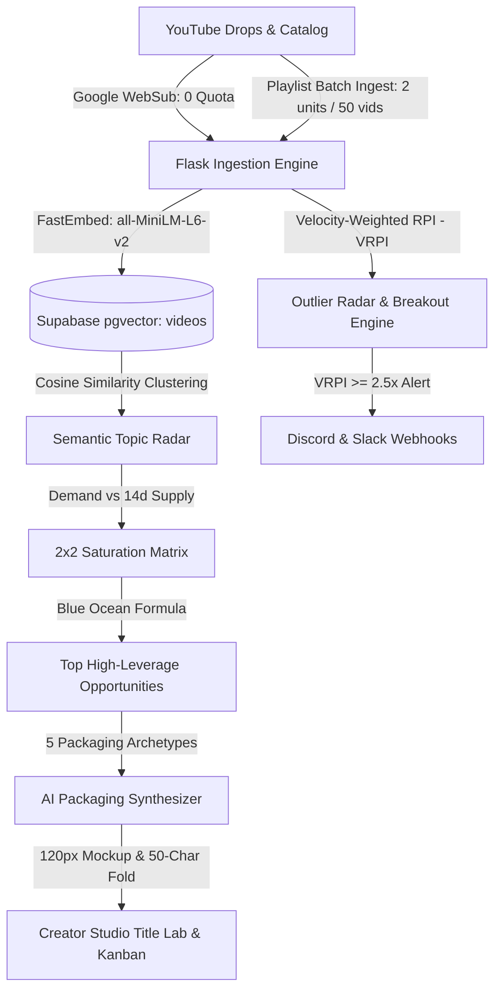

# ⚡ YT Tracker — YouTube Competitive Intelligence & Growth Studio

A production-grade, full-spectrum competitive intelligence platform and creator workflow suite for YouTube creators. Built with a calm, disciplined **Linear / Raycast-grade dark workspace aesthetic** (`#0b0c0e` dark surfaces, desaturated indigo `#6672f5` accent, tabular typography, Lucide vector icons), a modular **Flask & Vanilla ES6+ JS** architecture, cloud PostgreSQL persistence via **Supabase** with `pgvector`, and **near-zero YouTube Data API quota overhead**.

---

## 🌟 Platform Highlights & Intelligence Architecture



---

## 🧠 Advanced Intelligence Systems & Math

### 1. Velocity-Weighted RPI ($\text{VRPI}$) with Age Decay
Static Relative Performance Index ($\text{RPI} = \frac{\text{Views}}{\text{Median Baseline}}$) fails to distinguish a 2-day-old video with 20K views from a 2-year-old video with 20K views. YT Tracker computes **Velocity-Weighted RPI ($\text{VRPI}$)** with publication age decay:

$$\text{Video Velocity } V = \frac{\text{Current Views}}{\max(0.04, \text{Days Published})}$$

$$\text{Daily Baseline Velocity } V_{\text{base}} = \max\left(1, \frac{\text{Channel 30-Day Median Views}}{30}\right)$$

$$\text{Raw VRPI} = \frac{V}{V_{\text{base}}}$$

$$\text{Age Decay Factor} = \begin{cases} 1.0 & \text{if } \text{Age} \le 7\text{ days} \\ \frac{1}{\sqrt{1 + (\text{Age} - 7) / 21}} & \text{if } \text{Age} > 7\text{ days} \end{cases}$$

$$\text{VRPI} = \text{Raw VRPI} \cdot \text{Age Decay Factor}$$

- 🔥 **Breakout Outliers**: Fresh competitor uploads ($\le 14\text{d}$) surging at $\text{VRPI} \ge 2.5\times$ baseline velocity are automatically flagged with breakout tags and dispatched to configured webhooks.
- ⚡ **Velocity Spikes**: Uploads with $1.5\times \le \text{VRPI} < 2.5\times$ are highlighted with velocity surge tags in the live drops feed.

---

### 2. Empirical Bayes Shrinkage for Topic RPI
To prevent small-sample flukes (e.g. a topic with only 1 upload having high views) from distorting recommendations, the engine applies **Empirical Bayes Shrinkage**:

$$\text{RPI}_{\text{shrunken}} = w \cdot \text{RPI}_{\text{raw}} + (1 - w) \cdot 1.0, \quad \text{where } w = \frac{n}{n + 5}$$

*(As sample size $n$ increases, confidence smoothly approaches true field RPI).*

---

### 3. Supply vs. Demand 2×2 Saturation Matrix
Every topic is classified into one of 4 market quadrants:
- 💎 **Untapped Blue Ocean** (*High Demand · Low Supply*): High competitor views, low recent uploads, and **0 videos by your channel**. High breakout potential.
  $$\text{Blue Ocean Score} = \frac{\text{RPI}_{\text{shrunken}}}{1 + \text{Recent 14d Supply}}$$
- 🔥 **High Demand Staple** (*High Demand · High Supply*): Proven evergreen topics with steady search volume across the niche.
- 🌱 **Emerging Trend** (*Surging 14d Velocity*): Rapidly accelerating keyword velocity with low competitor saturation.
- ⚠️ **Saturated** (*Low Demand · High Supply*): Overcrowded topics with diminishing returns.

---

### 4. FastEmbed & Supabase `pgvector` Semantic Clustering
- Replaces brittle N-gram keyword matching with dense 384-dimensional vector embeddings using CPU-optimized `fastembed` (`sentence-transformers/all-MiniLM-L6-v2`).
- Stores embeddings in Supabase PostgreSQL using the `vector(384)` extension with an IVFFlat cosine similarity index (`scripts/migration_pgvector.sql`).
- Endpoint `POST /api/topics/semantic-clusters` groups narrative and concept titles into cohesive clusters regardless of phrasing syntax.

---

### 5. YouTube Mobile Feed & 50-Char Title Fold Simulator
Over 70% of YouTube viewership occurs on mobile devices where browse titles truncate after 45–55 characters:
- **120px Scale Thumbnail Mockup**: Live 16:9 feed preview with timestamp badge and high-contrast concept overlay.
- **50-Character Dynamic Fold Indicator**: Visual cutoff boundary marking characters 1–50 (`Visible on Mobile`) vs 51+ (`Truncated in Browse Feed`).
- **Hook Placement Intelligence**: Live diagnostic checking if the primary curiosity trigger / power keyword is front-loaded before the mobile truncation cutoff.

---

### 6. Zero-Quota Google WebSub Real-Time Listener
- **Endpoint**: `GET` & `POST` `/api/webhooks/youtube-sub`.
- Handles Google PubSubHubbub subscription challenges (`hub.challenge`) for **0 quota units**.
- When a tracked competitor publishes a video, YouTube immediately pushes an XML drop notification to the endpoint.
- Triggers a single-video `videos.list` fetch (**1 quota unit** instead of 100 units for polling `search.list`).

---

### 7. Outlier Radar Webhooks (Discord & Slack)
- Automated background worker scans competitor drops and fires rich webhook embeds whenever an upload hits $\text{VRPI} \ge 2.5\times$.
- Fully configurable in the **Settings Modal** with custom webhook URL, platform toggle (Discord / Slack), and adjustable VRPI multiplier slider ($2.0\times$ to $5.0\times$).

---

### 8. Reactive Vanilla JS Event Store (`appState`)
- Minimalist `Proxy`-backed reactive state container in `static/js/state.js`.
- Cross-view synchronization without frontend framework bloat: mutations to `appState.selectedTopic`, `appState.titleLabDraft`, or `appState.filterQuery` dispatch `appstate:${key}` DOM events and update views instantly.

---

## 🎨 Linear / Raycast-Grade Design & Explanation Layer

### 1. The 4-Tier Progressive Disclosure System
Never leaves the creator wondering *"What does this metric mean?"*:
- **L0 (Numbers)**: Clean tabular figures (`1.2K`, `4.5%`, `↑ 4%`) with no rainbow clutter.
- **L1 (Tooltips)**: Fast 120ms hover & focus tooltips on all `[data-tip]` metrics with a `"Learn more →"` trigger.
- **L2 (Detail Sheets)**: Slide-out drawer displaying exact mathematical formulas, interpretation guides, and tactical next steps.
- **L3 (Deep Dive)**: Dedicated full-screen forensics view with 90-day upload pulse, audience ratios, and topic moats.

### 2. Data Honesty & The "—" Rule
- If data is missing or calculations fail, the UI renders a clean em-dash (`—`) or `< 1%`, never a misleading `0` or hardcoded fallback.
- Professional SaaS tone: **Zero exclamation marks** in copy, tooltips, or toast notifications.

### 3. 60fps Motion & Animation
- **Single-Fire Viewport Observer (`ui/reveal.js`)**: Elements fade up once upon entering viewport and never re-trigger on scroll.
- **Hardware-Accelerated KPI Count-Up (`ui/countup.js`)**: Quartic easing ticker transitions with zero layout thrashing.
- **Full Reduced-Motion Support**: Respects `prefers-reduced-motion: reduce`.

### 4. Full Mobile & Responsive Design
- **Off-Canvas Drawer**: Desktop sidebar smoothly collapses into a slide-out drawer on screens $\le 768px$ with a hamburger trigger (`☰`).
- **Mobile Bottom Navigation Bar**: Fixed 5-tab bar (Overview, Competitors, Radar, Studio, Search) with active state indicators.
- **Adaptive Grids**: Responsive 1-column & 2-column KPI cards and Title Lab meters.

---

## 📊 Core Application Modules

### 1. Overview (Command Center)
- **Executive Hero**: Active channel details, subscriber count, and cohort ranking.
- **Next Step Card**: Exactly 1 prioritized strategic recommendation with "Why?" explanation link and 1-click "Plan in Studio" action.
- **4 Key Performance Indicators**: Subscribers, 30-Day Views Velocity, Upload Cadence, and Niche Share.
- **30-Day Performance Velocity Trajectory**: Interactive Chart.js curve with dark tooltips.
- **Recent Uploads**: Compact 5-row table with clear 16:9 thumbnails and relative age.

### 2. Competitors (Benchmark Grid)
- **Cohort Benchmark Table**: Instant search filter, tabular subscribers, view averages, total views, and sparkline trends.
- **Overlap Forensics**: Topic overlap percentage calculated via Jaccard similarity.
- **Recent Competitor Drops Feed**: Live feed of competitor video releases with daily view velocity and $\text{VRPI}$ outlier tags (`🔥 3.4× Outlier`).
- **Context Menus (`⋯`)**: View details, compare set, set primary, or remove competitor.

### 3. Topic Radar (Opportunities)
- **Top 8 High-Leverage Opportunities**: Ranked cards with plain-English rationales (*"Competitors average 12.4K views with 0 videos by you"*).
- **Niche Topic Catalog Table**: Searchable, paginated table with quadrant filters (All, Untapped, High Demand, Emerging).

### 4. Creator Studio
- **Title Lab Real-Time Scorer (0–100 CTR)**: Evaluates character length against the mobile fold boundary (40–60 chars), topic keyword demand, power curiosity hooks, and syntax structure.
- **Mobile Feed Simulator**: 120px scale thumbnail concept mockup with 50-character fold boundary and hook position diagnostic.
- **AI Packaging Synthesizer**: Generates 5 viral packaging archetypes (*Impossible Feat, Hidden Flaw, Head-to-Head, Zero-to-Mastery, Stress Test*) with thumbnail blueprints.
- **Kanban Content Pipeline**: 4 production stages (`Ideas` $\to$ `In Production` $\to$ `Scheduled` $\to$ `Published`).

### 5. Deep Dive Forensics
- **Channel Health Rail**: Engagement rates, upload cadence, publishing streak, and total catalog metrics.
- **90-Day Upload Pulse**: Week-bucketed publishing histogram.
- **Top Performing Videos & Topic Moats**: Breakdown of highest-performing uploads and keyword clusters.

---

## 🏗️ Architecture & Codebase Structure

```text
Youtube-Data-Manager/
├── server.py                   # Flask backend, WebSub listener, FastEmbed & Webhooks
├── requirements.txt            # Python dependencies (flask, supabase, fastembed, etc.)
├── Procfile                    # Production deployment configuration (Gunicorn)
├── settings.json               # Outlier Radar webhook configuration
├── test_phase1_6.py            # Automated test suite for backend intelligence upgrades
│
├── scripts/
│   ├── migration_pgvector.sql  # Supabase pgvector extension & IVFFlat cosine index
│   └── schema_v2.sql           # PostgreSQL schema (videos, channel_baselines, topic_metrics)
│
├── static/
│   ├── index.html              # Core application DOM shell (2-Pane Layout + Mobile Nav)
│   ├── style.css               # Master stylesheet aggregator (@import)
│   │
│   ├── css/                    # Modular Style System
│   │   ├── variables.css       # Design tokens (Surfaces, borders, text, single accent)
│   │   ├── base.css            # Layout resets, sidebar skeleton, typography
│   │   ├── ui.css              # Primitives: context menu, tooltips, sheets, mobile nav
│   │   ├── dashboard.css       # Executive KPIs, Chart.js wrap, activity feeds
│   │   ├── deep-dive.css       # Forensics inspector overlay & pulse charts
│   │   ├── studio.css          # Title Lab, Mobile Simulator, Synthesizer modal, Kanban
│   │   ├── modals.css          # Command palette, Settings, Glossary modal
│   │   └── print.css           # @media print rules for PDF export
│   │
│   └── js/                     # Modular JavaScript Engine
│       ├── ui/
│       │   ├── format.js       # Single source of truth for numbers, deltas & dates
│       │   ├── tooltip.js      # Singleton L1 hover/focus tooltip engine
│       │   ├── sheet.js        # Singleton L2 slide-out detail drawer
│       │   ├── glossary-modal.js # Searchable metric glossary reference modal (?)
│       │   ├── menu.js         # Singleton context dropdown menu (⋯)
│       │   ├── countup.js      # 60fps hardware-accelerated KPI tickers
│       │   └── reveal.js       # Single-fire IntersectionObserver viewport reveal
│       │
│       ├── data/
│       │   └── glossary.js     # Comprehensive data dictionary with 30+ definitions
│       │
│       ├── state.js            # ReactiveStore container (window.appState) & state
│       ├── dashboard.js        # Overview KPI grid, trajectory chart, next step card
│       ├── channels.js         # Competitor benchmark table & VRPI drops activity feed
│       ├── nlp-topics.js       # Topic radar, VRPI math, Bayes shrinkage, Blue Ocean scoring
│       ├── studio.js           # Title Lab scorer, Mobile Feed simulator, Synthesizer, Kanban
│       ├── deep-dive.js        # Channel forensics inspector modal
│       ├── timing.js           # Publication timing heatmap & timezone engine
│       ├── api.js              # API client & quota accounting
│       ├── settings-inbox.js   # Settings modal, Outlier Radar webhooks & alert inbox
│       ├── report-gamification.js # Report Center & export utilities
│       └── main.js             # Routing, mobile navigation drawer, reactive event listeners
```

---

## 🛠️ Technology Stack

- **Backend**: Python 3.9+ / Flask / Gunicorn
- **Embeddings & NLP**: FastEmbed (`sentence-transformers/all-MiniLM-L6-v2`) on CPU with N-gram fallback
- **Database & Vector Search**: Supabase (Cloud PostgreSQL) + `pgvector` IVFFlat Cosine Similarity
- **Frontend Architecture**: Vanilla HTML5, Modular CSS3 (Obsidian Dark Tokens, Linear Indigo `#6672f5`), Modular ES6+ JavaScript (`appState` Proxy Event Store)
- **Real-Time Drop Ingestion**: Google WebSub (PubSubHubbub Atom Feeds) — **0 Quota Cost**
- **Charting & Visualizations**: Chart.js 4.x (Linear curves, subtle gradient fills), SVG Sparklines
- **Icons**: Lucide Icons (vector SVG)
- **Typography**: Inter (UI & Displays), JetBrains Mono (Tabular Numerals & Code)
- **API**: YouTube Data API v3 (`google-api-python-client`) with client caching & thread pooling

---

## 📦 Local Setup & Installation

### 1. Clone & Install Dependencies
```bash
git clone https://github.com/khuzaima175/Youtube-Data-Manager.git
cd Youtube-Data-Manager

# Create and activate virtual environment
python -m venv venv

# On Windows PowerShell:
.\venv\Scripts\Activate.ps1

# On macOS / Linux:
source venv/bin/activate

# Install requirements
pip install -r requirements.txt
```

### 2. Configure Environment Variables
Create a `.env` file in the project root:
```env
YOUTUBE_API_KEY=your_youtube_api_key_here
SUPABASE_URL=https://your-project.supabase.co
SUPABASE_SERVICE_KEY=your_supabase_service_key_here
FLASK_DEBUG=1
PORT=5000
```

### 3. (Optional) Run Supabase pgvector Migration
In your Supabase SQL Editor, execute [`scripts/migration_pgvector.sql`](file:///g:/Important%20Projects/Youtube%20Data%20Manager/scripts/migration_pgvector.sql) to enable vector similarity search.

### 4. Run Automated Test Suite
```bash
python test_phase1_6.py
```

### 5. Run Locally
```bash
python server.py
```
Open your browser at **[http://localhost:5000](http://localhost:5000)**.

---

## ⌨️ Keyboard Shortcuts Reference

| Shortcut | Action |
| :--- | :--- |
| <kbd>⌘K</kbd> / <kbd>Ctrl+K</kbd> | Open Command Palette |
| <kbd>/</kbd> | Focus Channel Search |
| <kbd>?</kbd> | Open Metric Glossary & Help Modal |
| <kbd>1</kbd> | Switch to Overview |
| <kbd>2</kbd> | Switch to Competitors |
| <kbd>3</kbd> | Switch to Topic Radar |
| <kbd>4</kbd> | Switch to Creator Studio |
| <kbd>R</kbd> | Refresh All Tracked Channels |
| <kbd>Esc</kbd> | Close any active modal, detail sheet, or menu |

---

## ⚖️ License
MIT License. Developed for YouTube creators and analytics intelligence. Ensure compliance with YouTube API Terms of Service.