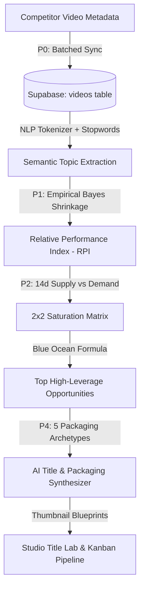

# ⚡ YT Tracker — YouTube Competitive Intelligence & Growth Studio

A production-grade, full-spectrum competitive intelligence platform and creator workflow suite for YouTube creators. Built with a calm, disciplined **Linear / Raycast-grade dark workspace aesthetic** (`#0b0c0e` dark surfaces, desaturated indigo `#6672f5` accent, tabular typography, Lucide vector icons), a modular **Flask & Vanilla ES6+ JS** architecture, cloud PostgreSQL persistence via **Supabase**, and zero YouTube Data API quota overhead.

---

## 🌟 Platform Highlights & Intelligence Architecture



---

## 🧠 How the Topic Recommendation Engine Works

When deciding **what video to make next**, YT Tracker replaces guesswork with a 4-step statistical pipeline:

```
[ All Niche Videos ] ──▶ [ NLP Token Extraction ] ──▶ [ Baseline-Normalized RPI ] ──▶ [ 2x2 Demand/Supply Matrix ] ──▶ [ Top 8 Opportunities ]
```

### 1. NLP Semantic Keyword Extraction
- Extracts single-word tokens and bigrams (e.g. `"3d modeling"`, `"solidworks sheet metal"`, `"cad fillet"`) across all tracked competitor video titles.
- Filters out non-informative stop-words (`how`, `tutorial`, `guide`, `vs`, `new`, `best`, `2026`) and merges aliases.

### 2. Baseline Normalization (RPI) + Empirical Bayes Shrinkage
- Comparing raw view counts between a 500K-subscriber channel and a 5K-subscriber channel is misleading.
- **RPI (Relative Performance Index)** divides a video's views by its channel's median baseline:
  $$\text{RPI} = \frac{\text{Video Views}}{\text{Channel Median Baseline}}$$
  *(An RPI of $2.5\times$ means the video did $250\%$ of that channel's normal views).*
- **Empirical Bayes Shrinkage** prevents low-sample flukes (e.g., 1 video with high views) from dominating:
  $$\text{RPI}_{\text{shrunken}} = w \cdot \text{RPI} + (1 - w) \cdot 1.0, \quad \text{where } w = \frac{n}{n + 5}$$
  *(As sample size $n$ grows, confidence approaches true field RPI).*

### 3. Supply vs. Demand 2×2 Saturation Matrix
Every topic is classified into one of 4 market quadrants:
- 💎 **Untapped Blue Ocean** (*High Demand · Low Supply*): High competitor views, low recent uploads, and **0 videos on your channel**. High breakout potential.
  $$\text{Blue Ocean Score} = \frac{\text{RPI}_{\text{shrunken}}}{1 + \text{Recent 14d Supply}}$$
- 🔥 **High Demand Staple** (*High Demand · High Supply*): Proven evergreen topics with steady search volume across the niche.
- 🌱 **Emerging Trend** (*Surging 14d Velocity*): Rapidly accelerating keyword velocity with low competitor saturation.
- ⚠️ **Saturated** (*Low Demand · High Supply*): Overcrowded topics with diminishing returns.

### 4. AI Title & Packaging Synthesizer
- For any recommended topic, automatically synthesizes **5 Proven Packaging Archetypes**:
  1. 🏆 **Impossible Feat**: Extreme curiosity and engineering intrigue (*"The Impossible Engineering Behind X"*)
  2. 🚨 **Hidden Flaw**: Loss-aversion pitfall warning (*"The Billion Dollar Flaw in X Nobody Talks About"*)
  3. ⚔️ **Head-to-Head**: Direct comparison showdown (*"X vs The Industry: The Brutal Truth"*)
  4. 🎓 **Zero-to-Mastery**: Complete step-by-step masterclass (*"I Mastered X in 30 Days"*)
  5. 💥 **Stress Test**: Extreme breaking point experiments (*"Pushing X to Its Breaking Point"*)
- Generates 16:9 **Thumbnail Concept Blueprints** with specific recipes for **Layout Composition**, **Focal Subject**, and **Color Contrast**.

---

## 🎨 Linear / Raycast-Grade Design & Explanation Layer

### 1. The 4-Tier Progressive Disclosure System
Never leaves the creator wondering *"What does this metric mean?"*:
- **L0 (Numbers)**: Clean tabular figures (`1.2K`, `4.5%`, `↑ 4%`) with no rainbow clutter.
- **L1 (Tooltips)**: Fast 120ms hover & focus tooltips on all `[data-tip]` metrics with a `"Learn more →"` trigger.
- **L2 (Detail Sheets)**: Slide-out drawer displaying exact mathematical formulas, interpretation guides, and tactical next steps.
- **L3 (Deep Dive)**: Dedicated full-screen forensics view with 90-day upload pulse, audience ratios, and topic moats.

### 2. Data Honesty & The "—" Rule
- If data is missing or calculations fail, the UI renders a clean em-dash (`—`) or `< 1%`, never a misleading `0` or hardcoded fallback.
- Professional SaaS tone: **Zero exclamation marks** in copy, tooltips, or toast notifications.

### 3. 60fps Motion & Animation
- **Single-Fire Viewport Observer (`ui/reveal.js`)**: Elements fade up once upon entering viewport and never re-trigger on scroll.
- **Hardware-Accelerated KPI Count-Up (`ui/countup.js`)**: Quartic easing ticker transitions with zero layout thrashing.
- **Full Reduced-Motion Support**: Respects `prefers-reduced-motion: reduce`.

### 4. Full Mobile & Responsive Design
- **Off-Canvas Drawer**: Desktop sidebar smoothly collapses into a slide-out drawer on screens $\le 768px$ with a hamburger trigger (`☰`).
- **Mobile Bottom Navigation Bar**: Fixed 5-tab bar (Overview, Competitors, Radar, Studio, Search) with active state indicators.
- **Adaptive Grids**: Responsive 1-column & 2-column KPI cards and Title Lab meters.

---

## 📊 Core Application Modules

### 1. Overview (Command Center)
- **Executive Hero**: Active channel details, subscriber count, and cohort ranking.
- **Next Step Card**: Exactly 1 prioritized strategic recommendation with "Why?" explanation link and 1-click "Plan in Studio" action.
- **4 Key Performance Indicators**: Subscribers, 30-Day Views Velocity, Upload Cadence, and Niche Share.
- **30-Day Performance Velocity Trajectory**: Interactive Chart.js curve with dark tooltips.
- **Recent Uploads**: Compact 5-row table with clear 16:9 thumbnails and relative age.

### 2. Competitors (Benchmark Grid)
- **Cohort Benchmark Table**: Instant search filter, tabular subscribers, view averages, total views, and sparkline trends.
- **Overlap Forensics**: Topic overlap percentage calculated via Jaccard similarity.
- **Competitor Drops Activity Feed**: Live feed of competitor video releases with daily view velocity.
- **Context Menus (`⋯`)**: View details, compare set, set primary, or remove competitor.

### 3. Topic Radar (Opportunities)
- **Top 8 High-Leverage Opportunities**: Ranked cards with plain-English rationales (*"Competitors average 12.4K views with 0 videos by you"*).
- **Niche Topic Catalog Table**: Searchable, paginated table with quadrant filters (All, Untapped, High Demand, Emerging).

### 4. Creator Studio
- **Title Lab Real-Time Scorer (0–100 CTR)**: Evaluates character length against the mobile truncation boundary (40–60 chars), topic keyword demand, power curiosity hooks, and syntax structure.
- **Algorithmic Concept Cards**: Moat Convergence, Gap Attack, Franchise Follow-Up, and Contrarian Take.
- **Kanban Content Pipeline**: 4 production stages (`Ideas` $\to$ `In Production` $\to$ `Scheduled` $\to$ `Published`).

### 5. Deep Dive Forensics
- **Channel Health Rail**: Engagement rates, upload cadence, publishing streak, and total catalog metrics.
- **90-Day Upload Pulse**: Week-bucketed publishing histogram.
- **Top Performing Videos & Topic Moats**: Breakdown of highest-performing uploads and keyword clusters.

---

## 🏗️ Architecture & Codebase Structure

```text
Youtube-Data-Manager/
├── server.py                   # Flask backend & proxy endpoints (Zero quota waste)
├── requirements.txt            # Python dependencies
├── Procfile                    # Production deployment configuration (Gunicorn)
│
├── docs/
│   └── ui-refactor/
│       ├── selector-inventory.md # 128 DOM IDs & contract hooks
│       └── DECISIONS.md        # Complete Phase 0–6 audit & decisions log
│
├── static/
│   ├── index.html              # Core application DOM shell (2-Pane Layout + Mobile Nav)
│   ├── style.css               # Master stylesheet aggregator (@import)
│   │
│   ├── css/                    # Modular Style System
│   │   ├── variables.css       # Design tokens (Surfaces, borders, text, single accent)
│   │   ├── base.css            # Layout resets, sidebar skeleton, typography
│   │   ├── ui.css              # Primitives: context menu, tooltips, sheets, mobile nav
│   │   ├── dashboard.css       # Executive KPIs, Chart.js wrap, activity feeds
│   │   ├── deep-dive.css       # Forensics inspector overlay & pulse charts
│   │   ├── studio.css          # Title Lab, Synthesizer modal, Kanban pipeline
│   │   ├── modals.css          # Command palette, Settings, Glossary modal
│   │   └── print.css           # @media print rules for PDF export
│   │
│   └── js/                     # Modular JavaScript Engine
│       ├── ui/
│       │   ├── format.js       # Single source of truth for numbers, deltas & dates
│       │   ├── tooltip.js      # Singleton L1 hover/focus tooltip engine
│       │   ├── sheet.js        # Singleton L2 slide-out detail drawer
│       │   ├── glossary-modal.js # Searchable metric glossary reference modal (?)
│       │   ├── menu.js         # Singleton context dropdown menu (⋯)
│       │   ├── countup.js      # 60fps hardware-accelerated KPI tickers
│       │   └── reveal.js       # Single-fire IntersectionObserver viewport reveal
│       │
│       ├── data/
│       │   └── glossary.js     # Comprehensive data dictionary with 30+ definitions
│       │
│       ├── dashboard.js        # Overview KPI grid, trajectory chart, next step card
│       ├── channels.js         # Competitor benchmark table & drops activity feed
│       ├── nlp-topics.js       # Topic radar, Empirical Bayes RPI, Blue Ocean scoring
│       ├── studio.js           # Title Lab scorer, AI packaging synthesizer, Kanban
│       ├── deep-dive.js        # Channel forensics inspector modal
│       ├── timing.js           # Publication timing heatmap & timezone engine
│       ├── state.js            # Global state & local storage persistence
│       ├── api.js              # API client & quota accounting
│       ├── settings-inbox.js   # Settings modal & alert inbox
│       ├── report-gamification.js # Report Center & export utilities
│       └── main.js             # Routing, mobile navigation drawer, command palette
│
└── scripts/
    └── schema_v2.sql           # PostgreSQL schema (videos, channel_baselines, topic_metrics)
```

---

## 🛠️ Technology Stack

- **Backend**: Python 3.9+ / Flask / Gunicorn
- **Database & Persistence**: Supabase (Cloud PostgreSQL) via `supabase-py`
- **Frontend Architecture**: Vanilla HTML5, Modular CSS3 (Obsidian Dark Tokens, Linear Indigo `#6672f5`), Modular ES6+ JavaScript
- **Charting & Visualizations**: Chart.js 4.x (Linear curves, subtle gradient fills), SVG Sparklines
- **Icons**: Lucide Icons (vector SVG)
- **Typography**: Inter (UI & Displays), JetBrains Mono (Tabular Numerals & Code)
- **API**: YouTube Data API v3 (`google-api-python-client`) with client caching & thread pooling

---

## 📦 Local Setup & Installation

### 1. Clone & Install Dependencies
```bash
git clone https://github.com/khuzaima175/Youtube-Data-Manager.git
cd Youtube-Data-Manager

# Create and activate virtual environment
python -m venv venv

# On Windows PowerShell:
.\venv\Scripts\Activate.ps1

# On macOS / Linux:
source venv/bin/activate

# Install requirements
pip install -r requirements.txt
```

### 2. Configure Environment Variables
Create a `.env` file in the project root:
```env
YOUTUBE_API_KEY=your_youtube_api_key_here
SUPABASE_URL=https://your-project.supabase.co
SUPABASE_SERVICE_KEY=your_supabase_service_key_here
FLASK_DEBUG=1
PORT=5000
```

### 3. Run Locally
```bash
python server.py
```
Open your browser at **[http://localhost:5000](http://localhost:5000)**.

---

## ⌨️ Keyboard Shortcuts Reference

| Shortcut | Action |
| :--- | :--- |
| <kbd>⌘K</kbd> / <kbd>Ctrl+K</kbd> | Open Command Palette |
| <kbd>/</kbd> | Focus Channel Search |
| <kbd>?</kbd> | Open Metric Glossary & Help Modal |
| <kbd>1</kbd> | Switch to Overview |
| <kbd>2</kbd> | Switch to Competitors |
| <kbd>3</kbd> | Switch to Topic Radar |
| <kbd>4</kbd> | Switch to Creator Studio |
| <kbd>R</kbd> | Refresh All Tracked Channels |
| <kbd>Esc</kbd> | Close any active modal, detail sheet, or menu |

---

## ⚖️ License
MIT License. Developed for YouTube creators and analytics intelligence. Ensure compliance with YouTube API Terms of Service.