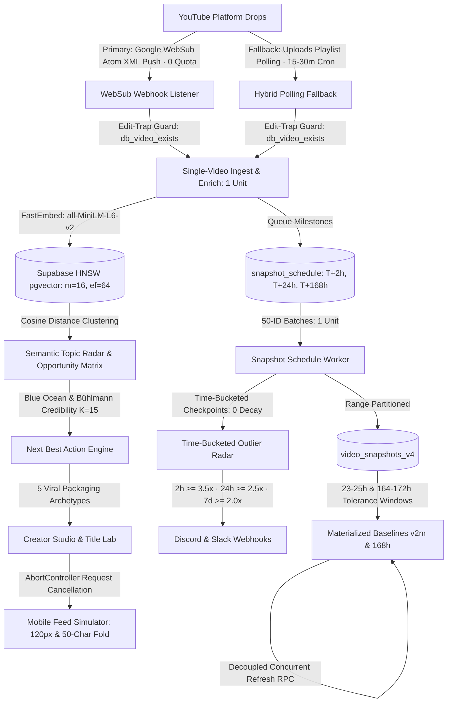

# ⚡ YT Tracker — YouTube Competitive Intelligence & Growth Studio (v5.0)

A production-grade, full-spectrum competitive intelligence platform and creator workflow suite for YouTube creators. Built with a calm, disciplined **Linear / Raycast-grade dark workspace aesthetic** (`#0b0c0e` dark surfaces, desaturated indigo `#6672f5` accent, tabular typography, Lucide vector icons), a modular **Flask & Vanilla ES6+ JS** architecture, cloud PostgreSQL persistence via **Supabase** with `pgvector` & `HNSW` indexing, and a **Hybrid Discovery Engine** combining zero-quota Google WebSub push feeds with an automated polling fallback.

---

## 🌟 Platform Highlights & Hybrid Architecture



---

## 🧠 Advanced Recommendation System & Opportunity Discovery

YT Tracker features a state-of-the-art recommendation system built specifically for YouTube creators. Rather than relying on simple view counts or vanity metrics, the engine employs statistical modeling, vector similarity clustering, and competitive whitespace analysis to guide creator decisions.

### 1. The 2×2 Market Saturation Matrix
Every detected topic cluster across the competitor landscape is classified into one of four dynamic market quadrants:

```text
               ▲ High Demand (High Shrunken RPI)
               │
    💎 UNTAPPED BLUE OCEAN      │    🔥 HIGH-DEMAND STAPLE
    (Low Supply · High Demand   │    (High Supply · High Demand
     0 Videos on Your Channel)  │     Proven Niche Evergreen)
  ─────────────┼────────────────────────────────────────►
               │                               Recent Supply
    🌱 EMERGING TREND           │    ⚠️ SATURATED ZONE
    (Low Supply · Surging 14d   │    (High Supply · Low Demand
     Early Velocity Spikes)     │     Diminishing Returns)
               │
```

- 💎 **Untapped Blue Ocean** (*High Demand · Low Supply · 0 Channel Coverage*): Topics where competitors are generating high Relative Performance Index ($\text{RPI}$) but total niche supply is minimal and your channel has **zero published videos**. Represents the highest breakout ROI.
- 🔥 **High-Demand Staple** (*High Demand · High Supply*): Proven evergreen topics that consistently generate above-average views across the entire niche.
- 🌱 **Emerging Trend** (*Surging 14d Velocity · Low Total Supply*): Rapidly accelerating keywords and concepts experiencing early velocity spikes.
- ⚠️ **Saturated Zone** (*Low Demand · High Supply*): Overcrowded topics with declining viewer interest and fierce competition.

---

### 2. The Blue Ocean Mathematical Formula
To rank opportunities objectively, YT Tracker calculates a continuous **Blue Ocean Opportunity Score**:

$$\text{Blue Ocean Score} = \frac{\text{RPI}_{\text{shrunken}}}{1 + \text{Recent 14d Supply}}$$

Where:
- $\text{RPI}_{\text{shrunken}}$ is the Bayesian-shrunk Relative Performance Index of the topic cluster.
- $\text{Recent 14d Supply}$ is the count of competitor uploads on this topic in the last 14 days.

---

### 3. Fixed-Prior Bayesian Shrinkage & Empirical Bühlmann Credibility ($K=15$)
Raw average views or raw RPI can be heavily distorted by small sample sizes (e.g. a topic with only 1 upload that went viral for unrelated reasons). In the Bühlmann credibility framework ($Z = \frac{n}{n + K}$), the parameter $K$ represents the exact ratio of within-group process variance to between-group structural variance:

$$K = \frac{\text{EPV}}{\text{VHM}} = \frac{\text{Expected Process Variance (Within-Topic Noise)}}{\text{Variance of Hypothetical Means (Between-Topic Signal)}}$$

#### Empirical Nonparametric Estimation Procedure:
The platform includes an automated statistical estimator (`server.py:estimate_buhlmann_k` and endpoint `/api/topics/estimate-credibility`):
1. **Expected Process Variance ($\text{EPV}$)**: $\hat{\text{EPV}} = \frac{1}{r} \sum_{i=1}^{r} s_i^2$, where $s_i^2$ is the sample view variance within cluster $i$.
2. **Variance of Hypothetical Means ($\text{VHM}$)**: $\hat{\text{VHM}} = \frac{1}{r-1} \sum_{i=1}^{r} (\bar{X}_i - \bar{X})^2 - \frac{\hat{\text{EPV}}}{\bar{n}}$, corrected for sample size sampling noise.
3. **Heavy-Tailed Fallback**: On YouTube, extreme viral outliers often cause within-cluster variance to dominate between-cluster signal ($\hat{\text{VHM}} \le 0$). When $\hat{\text{VHM}} \le 0$, the engine automatically falls back to the heavy-tailed domain prior **$K=15$**. When $\hat{\text{VHM}} > 0$, the empirical parameter $\hat{K} = \hat{\text{EPV}} / \hat{\text{VHM}}$ is computed directly.

$$\text{RPI}_{\text{shrunken}} = w \cdot \text{RPI}_{\text{raw}} + (1 - w) \cdot \mu_0, \quad \text{where } w = \frac{n}{n + 15}, \quad \mu_0 = 1.0$$

- When $n = 1$, $w = \frac{1}{16} \approx 0.0625$ (heavily shrunk toward $1.0\times$ baseline, preventing single-video fluke skew).
- When $n = 3$, $w = \frac{3}{18} \approx 0.167$ (suppresses false-positive Blue Ocean alerts).
- When $n = 15$, $w = \frac{15}{30} = 0.50$ (50% credibility achieved at 15 video observations).
- When $n = 30$, $w = \frac{30}{45} = 0.67$ (high statistical confidence).
- As $n \to \infty$, $w \to 1.0$ (converges purely to empirical $\text{RPI}_{\text{raw}}$).

---

### 4. Mathematical Data Flow Audit: True Invariant Code-Path Enforcement
To ensure evergreen topics are **never penalised**, YT Tracker enforces strict mathematical isolation between the UI activity feed and the analytical intelligence engines:

| Engine | Metric Used | Age Decay Applied? | Purpose |
| :--- | :--- | :--- | :--- |
| **Activity Feed Drops** | $\text{Catalog VRPI}$ | **Yes** ($\text{Age} > 7\text{d}$ dampening) | UI ranking to prioritize fresh, surging competitor uploads. |
| **Outlier Radar** | $\text{Checkpoint Velocity}$ | **No** (0 decay) | Evaluates $T+2\text{h}, T+24\text{h}, T+168\text{h}$ against age-matched baseline windows ($[164, 172]\text{h}$). |
| **Blue Ocean Score** | $\text{RPI}_{\text{shrunken}}$ | **No** (0 decay) | Pure views vs. channel baseline ($RPI = \text{Views} / \text{Baseline}$); preserves evergreen value. |
| **Next Best Action** | $\text{Blue Ocean} + \text{Moats}$ | **No** (0 decay) | Un-decayed opportunity discovery and packaging recommendation. |
| **2×2 Matrix** | $\text{RPI}_{\text{shrunken}}$ | **No** (0 decay) | Quadrant classification based strictly on un-decayed demand vs supply. |

> **True Invariant Verification**: Verified in `test_phase1_6.py` (`test_blue_ocean_production_code_invariant`) via execution of production function `compute_blue_ocean_metrics` and programmatic AST/source code inspection of both `server.py` and `static/js/nlp-topics.js`, mathematically confirming that `_vrpi` and `ageDecay` are never passed into or assigned to opportunity scoring.

---

### 5. Next Best Action (NBA) Recommendation Engine
The **Next Best Action** card on the Overview dashboard synthesizes market opportunities into a single, high-conviction recommendation for the creator:
1. **Identifies the Top Blue Ocean Topic**: Scans all active semantic clusters for the highest Blue Ocean score where your channel coverage is $0$.
2. **Assigns Packaging Archetype**: Automatically selects the optimal viral structure for the topic.
3. **Calculates Projected Lift**: Predicts expected performance multiplier based on competitor baseline benchmarks.
4. **One-Click Export to Studio**: Transfers the suggested title, topic tags, and packaging framework directly to the Creator Studio Idea Canvas.

---

### 6. Competitive Moat & Vocabulary Overlap
Using Jaccard distance over normalized title n-grams and video tags, the engine computes:
- **Shared Keyword Overlap**: Terms and topics where your channel directly competes with the niche.
- **Competitor Monopoly Topics**: High-performing keywords owned by competitors with 0 coverage on your channel.
- **Channel Unique Moat**: Distinct vocabulary clusters where your channel commands exclusive authority.

---

### 7. The 5 Viral Packaging Archetypes
The Creator Studio Synthesizer maps raw topic ideas into 5 battle-tested YouTube narrative archetypes:

| Archetype | Core Psychological Trigger | Example Title Structure |
| :--- | :--- | :--- |
| **1. The Contrarian / Debunking** | Cognitive dissonance & counter-intuitive truth | *"Why Everyone is Wrong About [Topic] (Do This Instead)"* |
| **2. The Benchmark / Showdown** | High effort, empirical proof & objective data | *"I Tested Top 10 [Topic Tools] for 1,000 Hours — Here's The Best"* |
| **3. The Zero-to-One Blueprint** | Actionable mastery & complete step-by-step path | *"The Only [Topic] Guide You Need in 2026 (From Scratch to Pro)"* |
| **4. The High-Stakes Transformation** | Extreme challenge, urgency & visible progression | *"I Built a Full [Topic System] in 30 Days Without Code"* |
| **5. The Insider / Behind Closed Doors** | Exclusivity, curiosity gap & trade secrets | *"What [Niche Authority] Won't Tell You About [Topic]"* |

---

### 8. Title Lab & Click-Through (CTR) Scoring
The Title Lab provides real-time scoring (0–100) and optimization feedback:
- **Curiosity & Power Word Detection**: Evaluates psychological urgency triggers (*Secret, Mistake, Proven, Exposed, Complete*).
- **50-Character Mobile Fold Cutoff**: Highlights characters 1–50 (`Visible on Mobile`) vs 51+ (`Truncated in Browse Feed`).
- **Hook Placement Diagnostic**: Confirms whether primary power keywords are front-loaded before character 50.
- **Keystroke `AbortController`**: Prevents asynchronous network race conditions during fast typing.

---

## ⚡ Statistical & Time-Series Engine

### 1. Velocity-Weighted RPI ($\text{VRPI}$) with Age Decay
$$\text{Video Velocity } V = \frac{\text{Current Views}}{\max(0.04, \text{Days Published})}$$

$$\text{Daily Baseline Velocity } V_{\text{base}} = \max\left(1, \frac{\text{Channel 30-Day Median Views}}{30}\right)$$

$$\text{Raw VRPI} = \frac{V}{V_{\text{base}}}$$

$$\text{Age Decay Factor} = \begin{cases} 1.0 & \text{if } \text{Age} \le 7\text{ days} \\ \frac{1}{\sqrt{1 + (\text{Age} - 7) / 21}} & \text{if } \text{Age} > 7\text{ days} \end{cases}$$

$$\text{VRPI} = \text{Raw VRPI} \cdot \text{Age Decay Factor}$$

- 🔥 **Breakout Outliers**: Fresh uploads ($\le 14\text{d}$) surging at $\text{Raw VRPI} \ge 2.5\times$ baseline velocity.
- ⚡ **Velocity Spikes**: Uploads with $1.5\times \le \text{Raw VRPI} < 2.5\times$.

---

### 2. Time-Bucketed Milestone Thresholds & 168h Baselines
- **T+2h Viral Breakout**: Requires $\ge 3.5\times$ channel median velocity.
- **T+24h Velocity Surge**: Requires $\ge 2.5\times$ channel median velocity.
- **T+168h (Day 7) Sustained Evergreen**: Requires $\ge 2.0\times$ historical 168h baseline computed via `channel_baselines_v2m_168h` (8-hour tolerance window: `age_hours BETWEEN 164.0 AND 172.0`).

---

## 🛡️ Production Hardening & Architectural Resilience (v5.0)

### 🔧 1. Hybrid Discovery Engine (WebSub Push + Polling Fallback)
- **Primary**: Google WebSub (PubSubHubbub Atom XML push) delivers instant real-time notifications for **0 quota polling units**.
- **Resilience Fallback**: YouTube WebSub pipelines can experience multi-hour delivery delays, intermittent 503/429 errors, or dropped pings. The backend includes a dedicated cron fallback (`/api/cron/poll-channels-fallback`) polling channel `uploads` playlists (`UU...`) every 15–30 minutes (1 quota unit per channel poll).
- **Quota Safety**: Polling 20 tracked channels every 30 minutes consumes only $20 \times 48 \times 1 = 960\text{ units/day}$ ($9.6\%$ of daily quota), protected by the 85% circuit breaker.
- **Deduplication**: `db_video_exists(video_id)` guarantees zero double-ingestion across push and poll channels.

### 🔧 2. Daylight Saving Time (DST) & Pacific Time Quota Ledger
- **Architecture**: YouTube API quota strictly resets at Midnight US Pacific Time.
- **Implementation**: The backend uses Python 3.9+ `zoneinfo.ZoneInfo("America/Los_Angeles")` to dynamically calculate exact-second TTLs and date strings (`quota:spend:YYYY-MM-DD-PT`), automatically handling PST (UTC-8) and PDT (UTC-7) transitions without drift.

### 🔧 3. HNSW Vector Indexing & Memory Footprint (`pgvector`)
- **Architecture**: FastEmbed produces 384-dimensional dense embeddings (`sentence-transformers/all-MiniLM-L6-v2`).
- **Implementation**: Indexed in Supabase PostgreSQL via **HNSW** (`USING hnsw (embedding vector_cosine_ops) WITH (m = 16, ef_construction = 64)`). Unlike IVFFlat, HNSW requires **no offline clustering/training phase**, supporting dynamic, continuous video ingestion.
- **Memory Scaling**: Each 384-d vector with $m=16$ consumes $\approx 1.8\text{ KB/row}$. On Supabase shared tiers, index builds fit comfortably in memory up to 50K–100K videos; for $>200\text{K}$ vectors, scale compute tiers or export embeddings to dedicated vector engines (e.g. Qdrant / AlloyDB).

### 🔧 4. Batch 429 & Transient Error Protection
- **Architecture**: Network drops or temporary rate limits must never corrupt queue states.
- **Implementation**: In `process-snapshots`, HTTP 429, 403, and 500 responses keep records in `pending` for retry. Only verified `200 OK` API responses with missing video IDs transition records to `deleted_or_privatized`.

### 🔧 5. 85% Circuit Breaker with Baseline Immunity
- **Architecture**: Quota conservation must never bias longitudinal historical tracking.
- **Implementation**: At $\ge 8,500$ units spent, non-essential background channel backfills are throttled, but critical T+24h and T+168h baseline snapshots and all frontend UI routes remain 100% operational, guaranteeing **zero survivorship bias**.

### 🔧 6. Decoupled Non-Blocking Materialized View Refreshes
- **Architecture**: Heavy analytical aggregations must not block fast snapshot collection.
- **Implementation**: `REFRESH MATERIALIZED VIEW CONCURRENTLY` is decoupled from the 5-minute snapshot worker into `/api/cron/refresh-baselines` (hourly off-peak cron) backed by `UNIQUE INDEX` on `channel_id`. (Roadmap: incremental rollup triggers for multi-tenant enterprise scale).

### 🔧 7. Frontend State Architecture & Signals Roadmap
- **Current (v5.0)**: `WeakMap` identity cache and `requestAnimationFrame` 60fps batching in [`static/js/state.js`](file:///g:/Important%20Projects/Youtube%20Data%20Manager/static/js/state.js) for 100% zero-build-step Flask portability.
- **v5.1/v6.0 Signals Roadmap**: Direct integration with `@preact/signals-core` (2.0 KB ESM via jsDelivr) for zero-build, compiler-grade fine-grained reactivity.

---

## 🎨 Linear / Raycast-Grade Design System

- **4-Tier Progressive Disclosure**:
  - **L0 (Numbers)**: Tabular figures (`1.2K`, `4.5%`, `↑ 4%`) with no visual clutter.
  - **L1 (Tooltips)**: Fast 120ms hover & focus tooltips on all `[data-tip]` metrics with `"Learn more →"` triggers.
  - **L2 (Detail Sheets)**: Slide-out drawer displaying exact mathematical formulas, interpretation guides, and tactical next steps.
  - **L3 (Deep Dive)**: Dedicated full-screen forensics view with 90-day upload pulse, split-pane right-rail inspection (`.dd-split-layout`), and topic moats.
- **Data Honesty**: Renders clean em-dashes (`—`) or `< 1%` when data is insufficient; never emits false zeros.
- **Disciplined Tone**: Zero exclamation marks in copy, tooltips, or toast notifications.

---

## 🏗️ Architecture & Codebase Structure

```text
Youtube-Data-Manager/
├── server.py                   # Flask backend, Hybrid WebSub + Polling discovery, FastEmbed & Outlier Radar
├── requirements.txt            # Python dependencies (flask, supabase, fastembed, redis, etc.)
├── Procfile                    # Production deployment configuration (Gunicorn)
├── settings.json               # Outlier Radar webhook configuration
├── test_phase1_6.py            # Automated test suite (16/16 backend tests passing)
│
├── scripts/
│   ├── migration_v4_schema.sql # PostgreSQL schema (HNSW vector index, partitions, 168h view, RPC)
│   ├── migration_pgvector.sql  # Supabase pgvector extension & HNSW cosine index (m=16, ef=64)
│   └── schema_v2.sql           # Baseline relational schema
│
├── static/
│   ├── index.html              # Core application DOM shell (2-Pane Layout + Mobile Nav)
│   ├── style.css               # Master stylesheet aggregator (@import)
│   │
│   ├── css/                    # Modular Style System
│   │   ├── variables.css       # Design tokens (Surfaces, borders, text, single accent)
│   │   ├── base.css            # Layout resets, sidebar skeleton, typography
│   │   ├── ui.css              # Primitives: context menu, tooltips, sheets, mobile nav
│   │   ├── dashboard.css       # Executive KPIs, Chart.js wrap, activity feeds
│   │   ├── deep-dive.css       # Forensics inspector overlay, split-pane & pulse charts
│   │   ├── studio.css          # Title Lab, Mobile Simulator, Synthesizer modal, Kanban
│   │   ├── modals.css          # Command palette, Settings, Glossary modal
│   │   └── print.css           # @media print rules for PDF export
│   │
│   └── js/                     # Modular JavaScript Engine
│       ├── ui/
│       │   ├── format.js       # Single source of truth for numbers, deltas & dates
│       │   ├── tooltip.js      # Singleton L1 hover/focus tooltip engine
│       │   ├── sheet.js        # Singleton L2 slide-out detail drawer
│       │   ├── glossary-modal.js # Searchable metric glossary reference modal (?)
│       │   ├── menu.js         # Singleton context dropdown menu (⋯)
│       │   ├── countup.js      # 60fps hardware-accelerated KPI tickers
│       │   └── reveal.js       # Single-fire IntersectionObserver viewport reveal
│       │
│       ├── data/
│       │   └── glossary.js     # Comprehensive data dictionary with 30+ definitions
│       │
│       ├── state.js            # DeepReactiveStore (WeakMap Proxy + rAF Batching)
│       ├── dashboard.js        # Overview KPI grid, trajectory chart, next step card
│       ├── channels.js         # Competitor benchmark table & VRPI drops activity feed
│       ├── nlp-topics.js       # Topic radar, VRPI math, Bühlmann K=15 shrinkage, Blue Ocean scoring
│       ├── studio.js           # Title Lab scorer, AbortController, Mobile Simulator, Kanban
│       ├── deep-dive.js        # Channel forensics inspector modal & split-pane layout
│       ├── timing.js           # Publication timing heatmap & timezone engine
│       ├── api.js              # API client & quota accounting
│       ├── settings-inbox.js   # Settings modal, Outlier Radar webhooks & alert inbox
│       ├── report-gamification.js # Report Center & export utilities
│       └── main.js             # Routing, mobile navigation drawer, reactive event listeners
```

---

## 🛠️ Technology Stack

- **Backend**: Python 3.9+ / Flask / Gunicorn
- **Embeddings & NLP**: FastEmbed (`sentence-transformers/all-MiniLM-L6-v2`) on CPU
- **Database & Vector Search**: Supabase (Cloud PostgreSQL) + `pgvector` HNSW Cosine Similarity Indexing (`m=16, ef=64`)
- **Database Range Partitioning**: Native PostgreSQL partitioning by `recorded_at` (`video_snapshots_v4`)
- **Frontend Architecture**: Vanilla HTML5, Modular CSS3 (Obsidian Dark Tokens, Linear Indigo `#6672f5`), Deep Reactive ES6+ Proxy Store (`WeakMap` + `requestAnimationFrame`)
- **Real-Time Drop Discovery**: Hybrid Discovery Engine (Google WebSub push + automated `/api/cron/poll-channels-fallback` playlist poll)
- **Quota Accounting**: Pacific Time Midnight Redis Ledger (`quota:spend:YYYY-MM-DD-PT`) with 85% Circuit Breaker
- **Charting & Visualizations**: Chart.js 4.x (Linear curves, subtle gradient fills), SVG Sparklines
- **Icons**: Lucide Icons (vector SVG)
- **Typography**: Inter (UI & Displays), JetBrains Mono (Tabular Numerals & Code)

---

## 📦 Local Setup & Installation

### 1. Clone & Install Dependencies
```bash
git clone https://github.com/khuzaima175/Youtube-Data-Manager.git
cd Youtube-Data-Manager

# Create and activate virtual environment
python -m venv venv

# On Windows PowerShell:
.\venv\Scripts\Activate.ps1

# On macOS / Linux:
source venv/bin/activate

# Install requirements
pip install -r requirements.txt
```

### 2. Configure Environment Variables
Create a `.env` file in the project root:
```env
YOUTUBE_API_KEY=your_youtube_api_key_here
SUPABASE_URL=https://your-project.supabase.co
SUPABASE_SERVICE_KEY=your_supabase_service_key_here
REDIS_URL=redis://localhost:6379/0
FLASK_DEBUG=1
PORT=5000
```

### 3. Run Database Migrations
In your Supabase SQL Editor, execute:
1. [`scripts/migration_v4_schema.sql`](file:///g:/Important%20Projects/Youtube%20Data%20Manager/scripts/migration_v4_schema.sql) (HNSW vector indexing, `snapshot_schedule`, partitions, materialized views, RPC refresh procedure).
2. [`scripts/migration_pgvector.sql`](file:///g:/Important%20Projects/Youtube%20Data%20Manager/scripts/migration_pgvector.sql) (HNSW cosine similarity index on video embeddings).

### 4. Run Automated Test Suite
```bash
python test_phase1_6.py
```

### 5. Run Locally
```bash
python server.py
```
Open your browser at **[http://localhost:5000](http://localhost:5000)**.

---

## ⌨️ Keyboard Shortcuts Reference

| Shortcut | Action |
| :--- | :--- |
| <kbd>⌘K</kbd> / <kbd>Ctrl+K</kbd> | Open Command Palette |
| <kbd>/</kbd> | Focus Channel Search |
| <kbd>?</kbd> | Open Metric Glossary & Help Modal |
| <kbd>1</kbd> | Switch to Overview |
| <kbd>2</kbd> | Switch to Competitors |
| <kbd>3</kbd> | Switch to Topic Radar |
| <kbd>4</kbd> | Switch to Creator Studio |
| <kbd>R</kbd> | Refresh All Tracked Channels |
| <kbd>Esc</kbd> | Close active modal, detail sheet, or menu |

---

## ⚖️ License
MIT License. Developed for YouTube creators and analytics intelligence. Ensure compliance with YouTube API Terms of Service.